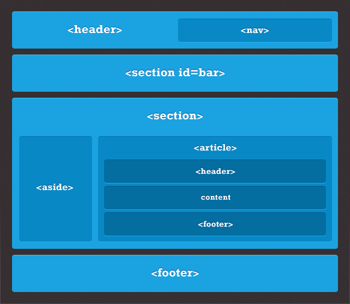

## Make sure you have..
1. Installed Google Chrome
2. Installed Sublime Text (or another text editor)
3. A short bio or a few blurbs you might like to include
4. A few pictures you might want to add
5. Downloaded the zip file (click **Clone or download**) from:
https://github.com/CBElizabeth/web-design-presentation

---

# Women, Wine & Web Design

### Introductory HTML and CSS Workshop

Instructor: Elizabeth Blackburn

Sponsored by **Tech Elevator** & **Cover My Meds**

---

## Who am I?

* Associate Web Developer @ The Wendy's Company
* Bootcamp Grad
* Maker of Things

---

## Before we get started..

1. Don't be afraid to ask questions.
2. Don't worry if things don't click at first.
3. Don't fall too in love with an idea.
4. Don't try to do too much.

---


## Unpacking Web Pages

---

## Content 
## + HTML (**Structure**)
## + CSS (**Style**)

---

## HTML (Structure)

HTML = **Hypertext Markup Language**
A web page is composed of **elements**
Elements are designated by **tags**

```html
<p>This is a paragraph element.</p>
<a href="https://www.google.com/">This is a link.</a>
<div>This is a div.</div>
 <!-- < That is an image. -->
<!-- And this is a comment! -->
```

---

**Container elements** typically includes an opening and a closing tag:

```html
<article>
	<p>The paragraph element is contained in the article element..
	and this text is the content of the paragraph element.</p>
</article>
```

**Void elements** are self-closing:

```html

<br>

```
---

**Semantic elements** clearly define their content:

```html
<section>
	<article>
		<h1>This heading is a heading :)</h1>
		<p>The section defines a section of the document.</p>
		<p>The article specifies independent, self-contained content.</p>
		<p>The paragraph defines a paragraph.</p>
	</article>
</section>
```

---



## A Few Types of Semantic Elements
* <header></header>
* <nav></nav>
* <aside></aside> (sidebars!)
* <section></section>
* <article></article>
* <footer></footer>

---

Element Attributes (**class**, **id**, etc.) provide **information** about the HTML element

```html
<section id="experience">
	<article class="text-box">
		<h1>My Experience</h1>
	</article>
</section>
```

---
...And then we use that information to style our content!

```css
.experience {
	background-color: #000000;
}
article.text-box {
	background-color: #FFFFFF;
}
```

---

## CSS (Style)

CSS = **Cascading Style Sheet**
CSS is used to apply styles to HTML elements.

Styles affect **position**, **size**, **color**, **depth**, **animate**..

..way more than we could hope to cover tonight!

---

```css
.experience {
	background-color: #000000;
}
```

**.experience** is the selector: what element gets styled?
**{ ... }** holds the declaration: what combination of styles should we apply?
**background-color** is the property: what part of the element are we modifying?
**#000000** is the value: how would we like to modify the property?

---

# Fire up those Chrome Devtools!

---

# Now.. 
# we dive in!

